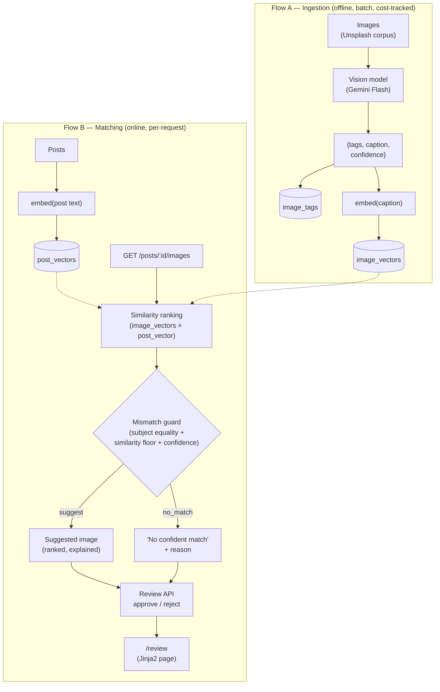

# Image Relevance & Auto-Tagging

FlyRank Backend Track capstone — "AI Image Understanding & Content Matching
Engine." Understands what's actually in an image library, tags it, and
matches each image to the right blog post: a red-fox post gets the red-fox
photo, never the wolf. The production-critical part isn't finding a match —
it's a **mismatch guard** that refuses a wrong pairing and explains why.

**Status: core complete.** All 5 build steps are done (see
[IMPLEMENTATION_LOG.md](IMPLEMENTATION_LOG.md) for the step-by-step record).
Top-1 precision: **100% (7/7)**. See Limitations below for what's still
rough around the edges.

## What it does

1. **Ingests & classifies** each image with a vision model (Gemini Flash,
   free tier) → structured tags `{subject, category, attributes, caption,
   confidence}`, validated against a schema. Low confidence is flagged, not
   guessed.
2. **Embeds** image captions and post text into one semantic space (Gemini
   embeddings, free tier), so "red fox" and "Vulpes vulpes" land close
   together even though the words differ.
3. **Ranks** candidate images per post by cosine similarity.
4. **Guards**: separates "is anything relevant at all" (similarity floor)
   from "is it the right animal" (canonical subject equality) — two
   mechanisms, not one blurred threshold. Proven on the fox/wolf/dog case.
5. **Reviews**: a minimal API to approve/reject a suggested pairing and see
   why it was suggested or refused.

## Architecture



Two runtime flows, kept separate on purpose: ingestion (Flow A) is offline,
batch, slow, and cost-tracked; matching (Flow B) is online, per-request, and
does no model calls on the hot path. Full design rationale in
[BRIEF.md](BRIEF.md).

## Data model

Postgres + pgvector (hosted on Supabase, free tier). Hand-written SQL
migrations in [`migrations/`](migrations/), no ORM. Schema: `subjects`
(seeded from [`vocab.py`](vocab.py)), `images`, `image_tags`,
`image_vectors`, `posts`, `post_vectors`, `pairings`, `model_calls` (cost
ledger). See [BRIEF.md §4](BRIEF.md) for the full DDL and index list.

## Running it

```bash
python3 -m venv .venv
.venv/bin/pip install -r requirements.txt
.venv/bin/pytest -v
```

Database: copy `.env.example` to `.env` and fill in `DATABASE_URL` from the
Supabase dashboard (Project Settings → Database) for the `autotagging`
project.

Vision/embeddings: requires a free Gemini API key from
[Google AI Studio](https://aistudio.google.com/apikey) (no credit card) —
`GEMINI_API_KEY` in `.env`.

Seed the corpus and run vision tagging for real:

```bash
.venv/bin/python -m scripts.seed_corpus   # idempotent, inserts the 48-image corpus
.venv/bin/python -m jobs.classify         # tags every untagged image
.venv/bin/python -m jobs.embed_images     # embeds every tagged image's caption
.venv/bin/python -m scripts.seed_posts    # seeds 8 sample posts + subject extraction
.venv/bin/python -m scripts.verify_matching  # live proof: ranking, guard rejection, paraphrase, no-match
.venv/bin/python -m eval.run_eval         # top-1 precision
```

Note: `DATABASE_URL` must point at Supabase's **connection pooler**
(`aws-0-<region>.pooler.supabase.com:6543`, username
`postgres.<project-ref>`), not the direct-connection host — the direct host
is IPv6-only and unreachable from most networks. `.env.example` has the
exact format.

Run the API and review UI:

```bash
.venv/bin/uvicorn api:app --reload --port 8000
```

Then open `http://localhost:8000/review` — pick a post, click **Suggest**
to see a real ranked recommendation, or use **Force a specific image** to
reproduce the "force the wolf, it still refuses" demo with any image in
the corpus. Full JSON API also available (`GET /posts`, `GET
/posts/{id}/images`, `POST /pairings/{id}/review`, `GET /pairings`, `GET
/costs/summary`) and self-documented at `/docs`.

## Evaluation

**Top-1 precision: 100% (7/7)**, measured by `eval/run_eval.py` against
hand-labeled ground truth in `posts_seed.py` (not the model's own subject
extraction — that would be circular). The 8th seed post (no corpus
coverage) is excluded from the precision denominator and checked
separately: does the system correctly refuse rather than guess? It does.
Full output in `EVIDENCE.md`.

## Limitations (honest, as of this writing)

- The corpus (`corpus.py`) is 48 images, not exactly ~50 — 8 per species
  across the 6 species in `vocab.py`.
- Default vision model is `gemini-3.1-flash-lite`, not the newest
  `gemini-3.6-flash` — the latter's free tier is 20 requests/day, too low
  for a 48-image batch. See BUILDLOG.md.
- Embedding cost tracking (`embeddings.py`) estimates tokens from text
  length (`len(text) // 4`) rather than a real usage field — Gemini's
  `embed_content` doesn't return one in this SDK version. Approximate, not
  exact.
- No auth on the API — fine for a local capstone demo, not for anything
  public-facing.
- Eval set is small (7 scoreable posts) by design (source brief's
  "realistic scope" — don't build a massive corpus). 100% on 7 examples is
  a real, honestly-measured signal, not a statistically strong claim.
- No stretch goals attempted (alt-text, near-duplicate detection, fallback
  generation, human-in-the-loop QA, Capstone-1 integration) — out of scope
  per BRIEF.md §2.

## Docs

- [BRIEF.md](BRIEF.md) — full architecture, data model, and build sequence.
- [IMPLEMENTATION_LOG.md](IMPLEMENTATION_LOG.md) — step-by-step technical
  build record, updated every step.
- [BUILDLOG.md](BUILDLOG.md) — honest AI-usage log: where AI helped, where
  it was wrong, what changed.
- [EVIDENCE.md](EVIDENCE.md) — one pasted proof per definition-of-done
  checkbox.
